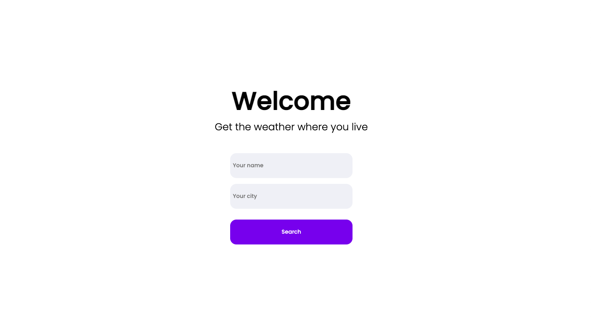
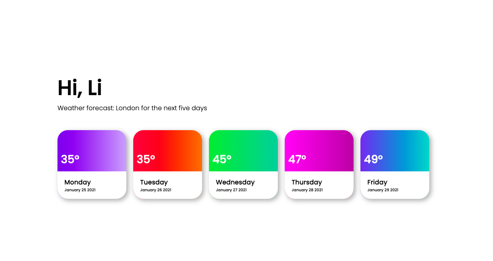

# Weather App Tech Assesment

This is a simple web application that will give you the weather for the next five days fdepending on the sity that you input.

## Screenshots

<p align="center">
  
  
</p>

## Getting started

1. Clone the repo

```
git clone https://github.com/LisaPisa12/weather-app-tech.git
cd weather-app-tech
```

2. Install dependencies

```
npm install
```

3. Start it up

```
'npm start'
```
